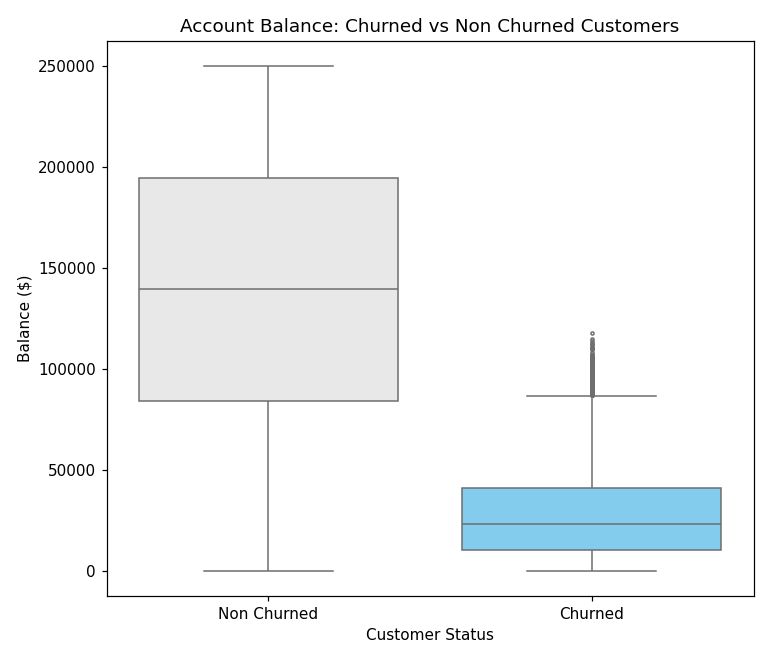
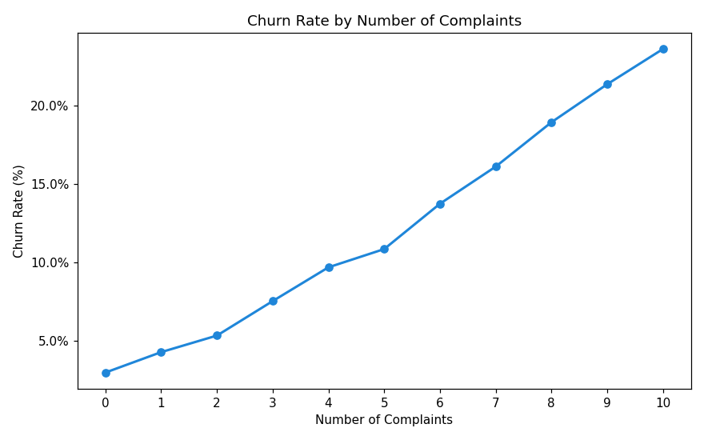
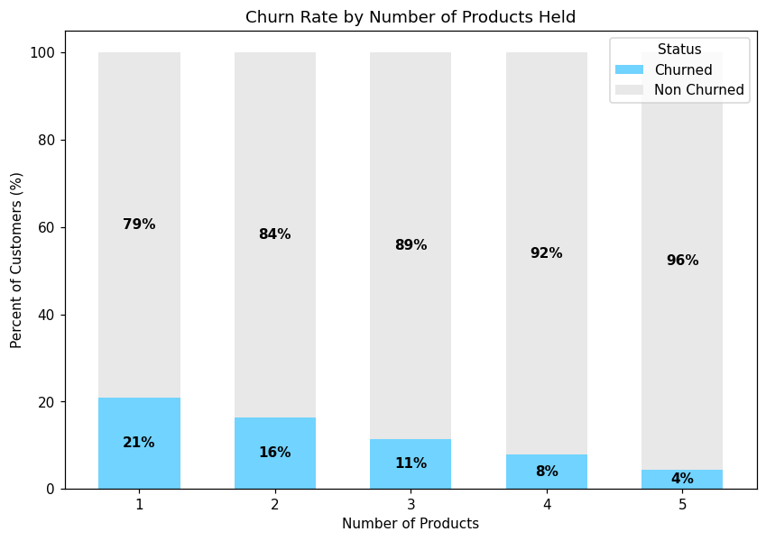
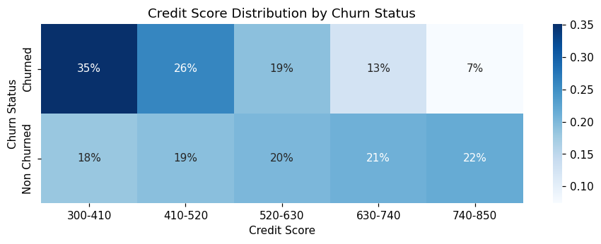

# Bank Customer Churn Analysis

Exploratory analysis of **115,640 bank customers** in Python (pandas, Matplotlib, Seaborn) to answer one business question: **who leaves the bank, and what do they have in common?**

Built as the Python project of the Data Analysis program at John Bryce Academy.

## Key findings

- **12.2% of customers churned** (14,094 of 115,640). The stated reasons are split almost evenly between Service Issues, Account Closure, Relocation and Better Offers Elsewhere, so there is no single dominant cause.
- **Balance is the strongest signal.** Median balance is about **$139.8K for retained customers vs $23.0K for churned ones**. No churned customer has a balance above $117,664.
- **Complaints drive churn steadily.** Churn rises from **3.0% with 0 complaints to 23.6% with 10**.
- **More products, less churn.** Churn falls from **20.9% (1 product) to 4.4% (5 products)**.
- **Credit score matters too.** Churned customers average a score of about 496, against about 585 for retained customers.
- **Demographics do not.** Region, gender, marital status, education and customer segment all stay within about 1 percentage point of the 12.2% baseline, so they were ruled out. Occupation (639 titles, roughly 140-220 customers each) was excluded as too noisy to read.
- **A concentrated high-risk profile.** Customers with 1 product, 8+ complaints, and below-median balance and credit score: **1,559 customers (1.3% of the base), of whom 78.6% churned**, about 6x the baseline. **334 of them are still active**, and their list was exported as a retention watchlist.

## Charts

| | |
|---|---|
|  |  |
|  |  |

## What I did

1. **Cleaned the data:** stripped stray spaces from column names, converted `$`-formatted text columns (Balance, Outstanding Loans) to numbers, converted dates, checked duplicates and category labels, and validated the churn flag against the churn date.
2. **Explored churn drivers:** compared churn rates across every category and numeric field, and identified outliers with the 1.5x IQR rule (190 churned customers with unusually high balances, almost all with 7+ complaints).
3. **Visualized the findings:** bar, horizontal bar, pie, box, line, scatter, histogram and heatmap charts.
4. **Turned findings into action:** built a watchlist of active customers who match the highest-risk profile.

## Data and limitations

- **Source:** [Bank Customer Churn (Kaggle)](https://www.kaggle.com/datasets/sandiledesmondmfazi/bank-customer-churn). The data is **synthetic** (generated with Python's Faker library), so relationships reflect how it was built, not real customer behavior.
- The raw addresses used US-style states, which does not fit a Botswana bank. I replaced them with randomly assigned Botswana towns using Faker. **`Region` is therefore random and carries no signal**, which the analysis confirms.
- Churn dates only cover **Jan-Aug 2024**, and August is a partial month, so a monthly trend is not reliable.
- This is a descriptive analysis: it shows association, not causation, and no predictive model was built.
- The dataset is not included in this repo. Download it from Kaggle and place it in `data/`.

## Run it yourself

```bash
pip install -r requirements.txt
```

1. Download the CSV from the Kaggle link above and save it as `data/bank_file.csv`.
2. Run `churn_analysis.py`.

## Tools

Python · pandas · Matplotlib · Seaborn · Faker · openpyxl

## Author

**Leonardo Rinaldi**, Junior Data Analyst
[LinkedIn](https://www.linkedin.com/in/leonardo-rinaldi-5706b4436)
